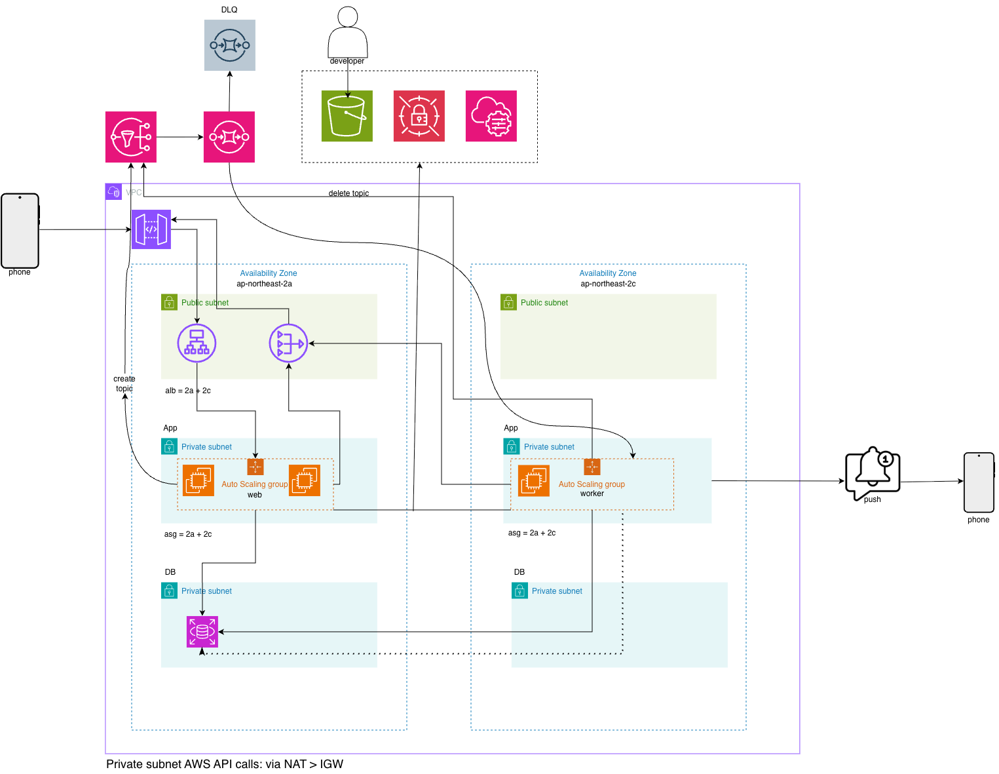

# QRing

QR 코드로 모인 사람들에게 웹 푸시 알림을 보내 단기 연락망 구축을 원할히 하는 것을 목표로 하는 프로젝트.

앱 설치와 로그인 없이, 발송이 몰려도 막히지 않는 구조를 만드는 것을 목표로 합니다. 화면은 이 파이프라인을 검증하기 위한 최소한으로 구성했습니다.

## 아키텍처



사용자 요청은 ALB를 거쳐 web ASG의 Express 서버로 전달됩니다.

**핵심은 API가 알림을 직접 보내지 않는다는 점입니다.** `POST /channels/:id/notifications`는 알림을 DB에 기록하고 SNS에 발행한 뒤 즉시 `202`를 반환합니다. 실제 발송은 별도 프로세스인 워커가 SQS를 롱 폴링하며 처리합니다. 구독자가 늘어나도 운영자가 기다리는 시간은 늘지 않고, 워커 ASG만 늘리면 되는 구조입니다.

SNS 토픽은 **채널 하나당 하나씩** 만들어집니다. 채널이 런타임에 몇 개 생길지 알 수 없어 Terraform이 아니라 애플리케이션 이 생성하고, 채널 만료 시 삭제합니다.

배포는  `server/`를 빌드해 S3에 zip으로 올리고, ASG가 띄운 EC2가 부팅 시 그 zip을 내려받아 실행합니다.

## 기술 스택

| 구성 요소 | 선택 | 이유 |
| --- | --- | --- |
| 런타임 | Node.js + TypeScript | — |
| 웹 프레임워크 | Express | — |
| 데이터베이스 | PostgreSQL (RDS) | 채널·구독·발송·응답의 관계가 명확하고 멱등성 보장에 복합 PK를 사용 |
| ORM | Drizzle | SQL 실행을 명확히 파악하고 제어 |
| 메시지 전달 | SNS > SQS | API와 발송의 분리 |
| 푸시 | web-push (VAPID) | 앱 설치 없이 브라우저로 발송 |
| IaC | Terraform | 인프라를 코드로 관리 및 문서화 |
| 배포 | S3 + EC2 user-data | 부팅 시 S3에서 받아 기동 |

## 발송 경로가 두 개인 이유

정상 경로는 `API → SNS → SQS → 워커`입니다. 여기에 더해 워커 안에 **재발행 스위퍼**(`worker/republisher.ts`)가 0.5초마다 돌면서, `QUEUED` 상태로 0.5초 넘게 머문 알림을 찾아 **SNS/SQS를 거치지 않고** 발송 함수를 직접 호출합니다.

SNS 발행은 성공하는데 SQS에 메시지가 도착하지 않는 현상이 산발적으로 발생했기 때문입니다(아래 트러블슈팅 참조). 스위퍼가 SNS에 다시 발행하는 방식도 시도했지만, 재발행 역시 같은 경로를 타기 때문에 같은 확률로 유실됐습니다. 문제의 경로 자체를 타지 않는 쪽으로 바꾼 뒤에야 지연이 안정적으로 1초 미만이 되었습니다.

두 경로가 같은 알림을 동시에 처리할 수 있으므로, 발송 로직 전체를 트랜잭션 + `pg_advisory_xact_lock(hashtext(notificationId))`로 감쌌습니다. 구독자별 발송 기록(`deliveries`)이 복합 PK와 `SENT` 상태 검사를 갖고 있어, 어느 경로로 몇 번 트리거되든 사용자에게 중복 발송되지 않습니다.

## 디렉터리 구조

```
.
├── infra/
│   ├── terraform/
│   │   ├── network.tf          # VPC, 서브넷, IGW, NAT, 라우팅
│   │   ├── sg.tf               # 보안 그룹 (SG 참조 방식)
│   │   ├── rds.tf              # PostgreSQL 16, 마스터 암호는 Secrets Manager 관리
│   │   ├── alb.tf              # ALB, 타깃 그룹, 리스너
│   │   ├── asg.tf              # web / worker ASG
│   │   ├── launch-template.tf  # AMI, 인스턴스 프로파일, user-data 렌더링
│   │   ├── iam.tf              # 역할, 권한 경계
│   │   ├── sqs.tf              # 발송 큐 + DLQ, SNS 발신 허용 정책
│   │   ├── deploy.tf           # 배포 아티팩트 S3 버킷
│   │   └── state-bucket.tf     # state 백엔드 버킷
│   ├── templates/
│   │   └── user-data.sh.tftpl  # 부팅 스크립트 (코드 수신 → .env 생성 → 마이그레이션 → 기동)
│   └── scripts/
│       └── deploy.sh           # 빌드 + 화이트리스트 zip + S3 업로드
└── server/
    ├── src/
    │   ├── config.ts           # 환경변수 로드 + VAPID 초기화
    │   ├── index.ts            # Express 진입점
    │   ├── db/                 # 스키마, 클라이언트, 마이그레이터
    │   ├── aws/                # SNS/SQS 클라이언트
    │   ├── routes/             # channels(운영자) / public(참여자)
    │   ├── middleware/         # 운영자 인증, 사용 제한
    │   └── worker/
    │       ├── index.ts        # SQS 롱 폴링
    │       ├── processor.ts    # 발송 로직 (멱등)
    │       ├── republisher.ts  # 정체된 알림 직접 처리
    │       └── janitor.ts      # 만료 채널 정리, 개인정보 삭제
    ├── public/                 # 정적 프론트엔드 (서버가 직접 서빙)
    ├── drizzle/                # 마이그레이션 SQL
    └── docker-compose.yml      # 로컬 PostgreSQL
```

## 실행 방법

### 로컬

**시작 전에 `.env`를 먼저 채워야 합니다.** 서버는 기동 시점에 아래 값이 하나라도 비어 있으면 그대로 종료됩니다.

| 값 | 명령 |
| --- | --- |
| `VAPID_PUBLIC_KEY`, `VAPID_PRIVATE_KEY` | `npx web-push generate-vapid-keys` |
| `VAPID_SUBJECT` | `mailto:` 형식의 연락처 |
| `WEBPUSH_DISPATCH_QUEUE_ARN`, `WEBPUSH_DISPATCH_QUEUE_URL` | `terraform output` (아래 [AWS 배포](#aws-배포) 참조) |
| `DATABASE_URL` | `.env.example`의 기본값을 그대로 사용 |

**VAPID 키를 재발급하면 기존 구독이 전부 무효화됩니다.**

```bash
cd server
cp .env.example .env
npm install
docker compose up -d
npm run db:migrate
```

서버와 워커는 별도의 터미널에서 각각 실행합니다.

```bash
npm run dev
```

```bash
npm run worker
```

AWS(SNS/SQS)를 사용하는 코드를 실행하려면 SSO 로그인이 필요합니다.

```bash
aws sso login --profile <프로필명>
```

웹 푸시는 HTTPS에서만 동작하므로 테스트에는 터널이 필요합니다. 아래 터널은 **실행할 때마다 주소가 바뀐다는 것**을 주의해주세요.

```bash
cloudflared tunnel --url http://localhost:3000
```

### AWS 배포

state 백엔드 설정은 계정별 값이라 커밋되어 있지 않습니다. 버킷·키·리전을 직접 작성해야 합니다.

```bash
cd infra/terraform
terraform init -backend-config=backend.hcl
terraform apply
```

**주의:** `apply`는 ASG까지 만들기 때문에, S3에 아티팩트가 없는 상태에서 EC2가 먼저 부팅하기 때문에 헬스체크에 실패합니다.

VAPID 키 3개를 SSM 파라미터 스토어에 등록합니다(`/qring/vapid-public-key`, `/qring/vapid-private-key`는 SecureString, `/qring/vapid-subject`). 부팅 스크립트가 이 값을 읽어 `.env`를 만듭니다.

```bash
infra/scripts/deploy.sh
```

`deploy.sh`가 `server/`를 빌드해 zip으로 묶어 S3에 올립니다. 다음 인스턴스 교체부터 이 아티팩트로 기동합니다.

## API

### 운영자 (`Authorization: Bearer {adminToken}`)

| Method | Path | 설명 |
| --- | --- | --- |
| POST | `/channels` | 채널 생성 (인증 불필요, IP당 시간당 10개) |
| GET | `/channels/:id` | 채널 상태·구독자 수 조회 |
| GET | `/channels/:id/qr` | 참여 QR 코드 이미지 |
| POST | `/channels/:id/notifications` | 발송 요청 → `202` (채널당 분당 5회) |
| GET | `/channels/:id/notifications/:nid/responses` | 확인자 / 미확인자 목록 |
| POST | `/channels/:id/close` | 채널 종료 |

채널 생성 응답의 운영자 토큰은 URL 프래그먼트(`#token=`)로 전달됩니다. 브라우저가 서버로 보내지 않습니다.

### 참여자 (비로그인)

| Method | Path | 설명 |
| --- | --- | --- |
| GET | `/public/vapid-public-key` | 구독에 필요한 공개키 |
| GET | `/public/channels/:code` | 채널 정보 조회 |
| POST | `/public/channels/:code/subscriptions` | 푸시 구독 등록 |
| GET | `/public/notifications/:nid` | 알림 내용 조회 |
| PUT | `/public/subscriptions/:id/responses/:nid` | 확인 응답 |
| DELETE | `/public/subscriptions/:id` | 구독 해지 |

## 트러블슈팅

### SNS 발행은 성공하는데 SQS에 메시지가 도착하지 않는 현상

`aws sns publish`로 직접 호출해도 동일했고, **같은 토픽·같은 구독에서 성공과 실패가 섞여** 발생했습니다. SQS 프로토콜 구독은 전달이 거의 보장되는 방식이라 흔한 증상이 아닙니다.

스위퍼가 SNS에 재발행하는 방식을 먼저 만들었으나, 재발행도 같은 경로를 타기 때문에 유실이 반복됐습니다(최악 3.1초). SNS/SQS를 건너뛰고 워커가 발송 함수를 직접 호출하도록 바꾼 뒤, 9건 연속 발송에서 전부 1초 미만으로 완료됐습니다.

### 부팅 시 마이그레이션이 동시에 실행되어 실패하는 현상

web ASG의 `desired_capacity`가 2라 인스턴스 2대가 항상 함께 뜹니다. 두 대가 동시에 마이그레이션을 실행하면 한쪽이 `CREATE SCHEMA drizzle` 충돌로 죽습니다.

이를 해결하기 위해 `pg_advisory_lock`으로 직렬화했습니다. 이 락은 **세션 단위**라 커넥션 풀에서 커넥션 하나를 따로 잡아 들고 있어야 합니다. 마이그레이션은 `Type=oneshot` systemd 유닛으로 분리하고 앱 유닛에 `Requires=` / `After=`를 걸었습니다.

트레이드오프로, 마이그레이션이 실패하면 웹이 뜨지 않아 헬스체크가 실패하고 ASG가 인스턴스를 교체합니다. **인스턴스 교체 루프**로 증상이 나타나므로, 그 경우 `journalctl -u qring-migrate`부터 확인합니다.

또한 `drizzle-kit`은 devDependency라 프로덕션 배포본에 없습니다. `drizzle-orm`에 내장된 마이그레이터를 쓰는 스크립트를 따로 만들었고, 마이그레이션 폴더는 cwd가 아닌 `__dirname` 기준으로 잡아 로컬과 EC2 양쪽에서 동작하게 했습니다.

### systemd가 DB 비밀번호를 잘라먹는 현상

RDS가 자동 생성한 마스터 암호에 `#`이 들어 있었습니다. systemd의 `EnvironmentFile` 파서는 값 안의 `#`을 주석 시작으로 보고 뒤를 잘라내어 호스트 이름을 잘못 해석합니다.

예상했던 인증 실패가 아니라 **호스트 이름 조회 실패**로 나타난 것이 함정이었습니다. 부팅 스크립트에서 암호를 `jq -r '.password | @uri'`로 퍼센트 인코딩해 해결했습니다. 

### RDS에 연결되지 않는 현상

RDS PostgreSQL 15부터 `rds.force_ssl=1`이 기본값이라 평문 접속이 거부됩니다. `pg` 드라이버는 psql과 달리 기본값이 "SSL 사용 안 함"이라 연결 자체가 성립하지 않습니다.

`DATABASE_SSL_CA` 환경변수가 있으면 해당 CA로 **검증하며** 접속하도록 DB 클라이언트를 분기했습니다. 부팅 스크립트가 RDS CA 번들을 내려받아 그 경로를 `.env`에 넣습니다. CA가 없는 로컬 Docker에서는 평문으로 붙습니다.

## 한계

- **ALB에 HTTPS가 적용되어 있지 않습니다.** 도메인과 인증서를 연결하지 않아 리스너가 HTTP뿐입니다. 웹 푸시는 HTTPS를 요구하므로 실기기 테스트는 터널을 사용했습니다.
- **SNS→SQS 유실의 근본 원인을 규명하지 못했습니다.** 재발행 스위퍼는 증상 완화책입니다.
- RDS는 Single-AZ이고 NAT 게이트웨이도 한 대입니다. 가용성보다 비용을 택했습니다.
